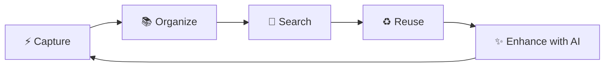
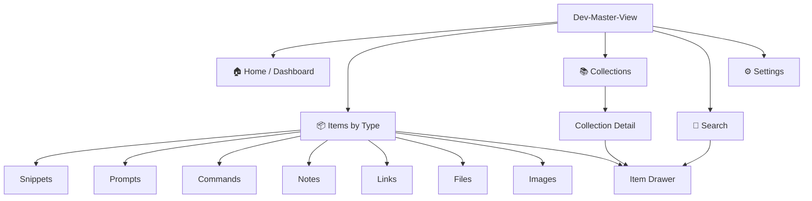
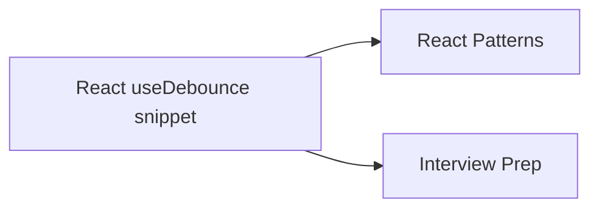
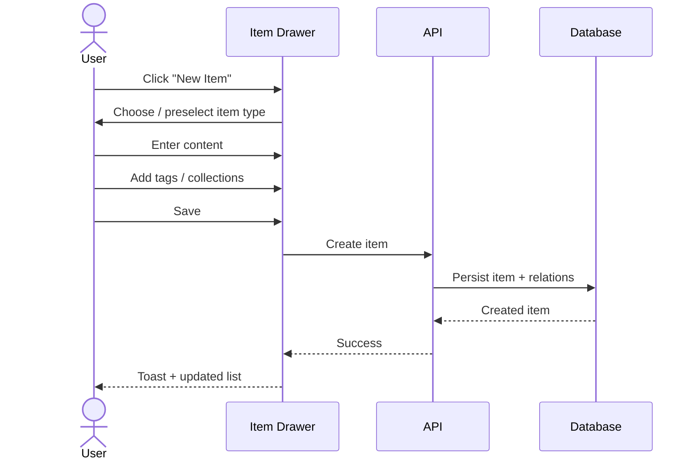
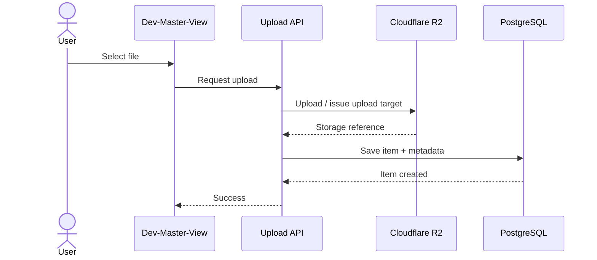
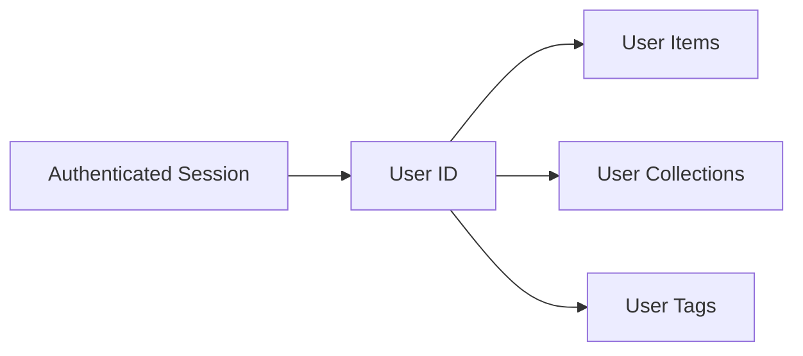
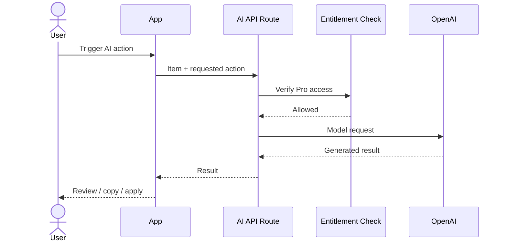
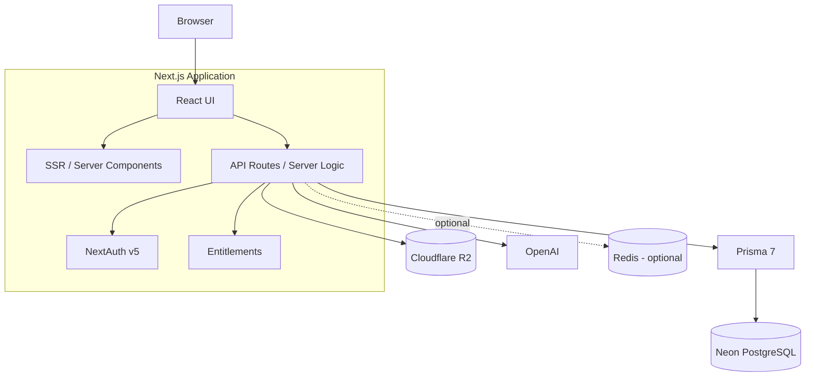
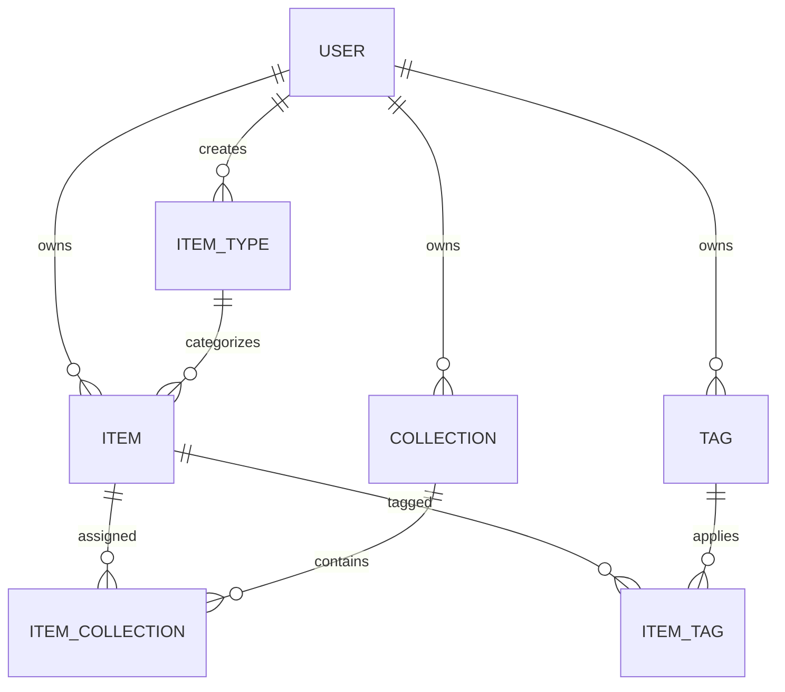
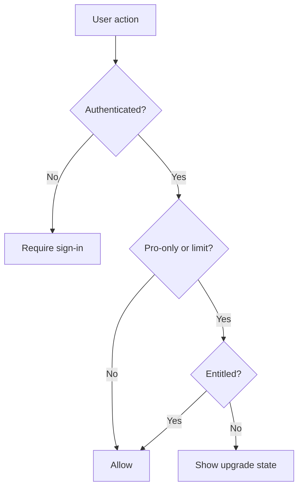

# Dev-Master-View — Project Overview & Product Specification

> **Dev-Master-View** is a developer knowledge hub for capturing, organizing, finding, and reusing code snippets, prompts, commands, notes, links, files, images, and other development resources.

**Core promise:** everything a developer wants to reuse should be only a few seconds away.

---

## 1. Product Overview

### 1.1 Problem

Developers routinely spread useful knowledge across:

- VS Code and local files
- AI chat history
- Notion and note-taking tools
- Browser bookmarks
- GitHub gists and repositories
- Project folders
- Terminal history
- Text files containing commands or setup instructions

This creates three recurring problems:

1. **Context switching** — developers must remember where something was saved.
2. **Knowledge loss** — useful snippets, prompts, and commands are difficult to rediscover.
3. **Workflow inconsistency** — reusable knowledge is stored in different formats with no shared structure.

Dev-Master-View solves this by providing **one fast, searchable, developer-focused workspace** for reusable technical knowledge.

### 1.2 Product loop



### 1.3 Product principles

- **Fast first:** common actions should require minimal navigation.
- **Search over browsing:** users should not need to remember where an item lives.
- **Flexible organization:** collections and tags should complement each other.
- **Developer-native:** Markdown, syntax highlighting, commands, files, and keyboard-friendly interactions.
- **Low friction:** item creation and viewing should happen without leaving the current context.
- **Progressive power:** basic organization works without AI; AI enhances existing workflows.
- **One codebase:** keep product and infrastructure overhead low during the early stages.

---

## 2. Target Users

| Persona               | Typical content                                    | Primary need                                          |
| --------------------- | -------------------------------------------------- | ----------------------------------------------------- |
| 👨‍💻 Everyday developer | Snippets, commands, links, notes                   | Quickly save and retrieve frequently reused knowledge |
| ✨ AI-first developer | Prompts, context files, workflows, system messages | Maintain reusable AI context and prompt libraries     |
| 🎓 Creator / educator | Code examples, explanations, course notes          | Organize teaching and content-development material    |
| 🧩 Full-stack builder | Boilerplates, APIs, patterns, project resources    | Reuse implementation patterns across projects         |

### Primary MVP persona

The first release should optimize primarily for the **everyday developer / full-stack builder** who repeatedly reuses snippets, commands, prompts, links, and technical notes.

---

## 3. Information Architecture



### Suggested route structure

```text
/
├─ /items
│  ├─ /snippets
│  ├─ /prompts
│  ├─ /commands
│  ├─ /notes
│  ├─ /links
│  ├─ /files
│  └─ /images
├─ /collections
│  └─ /[collectionId]
├─ /search
└─ /settings
   ├─ /account
   ├─ /billing
   └─ /preferences
```

The source planning notes explicitly use routes such as `/items/snippets`; the rest of the route tree above is a recommended extension of that convention.

---

# 4. Core Domain Model

## 4.1 Items

An **Item** is the primary piece of reusable knowledge stored by a user.

Every item has:

- Title
- Item type
- Owner
- Created/updated timestamps

Depending on its type, an item may also contain:

- Text content
- URL
- File reference
- Description
- Language
- Tags
- Collection assignments
- Favorite state
- Pinned state

### System item types

System item types are built into the product and cannot be edited or deleted.

| Type    | Storage kind | Icon         | Color     | Plan |
| ------- | ------------ | ------------ | --------- | ---- |
| Snippet | Text         | `Code`       | `#3b82f6` | Free |
| Prompt  | Text         | `Sparkles`   | `#8b5cf6` | Free |
| Command | Text         | `Terminal`   | `#f97316` | Free |
| Note    | Text         | `StickyNote` | `#fde047` | Free |
| Link    | URL          | `Link`       | `#10b981` | Free |
| File    | File         | `File`       | `#6b7280` | Pro  |
| Image   | File         | `Image`      | `#ec4899` | Pro  |

Custom item types are planned for a later Pro release.

### Item URL convention

```text
/items/{type-slug}
```

Examples:

```text
/items/snippets
/items/prompts
/items/commands
```

### Item content rules

| Item type | Required content        | Optional content            |
| --------- | ----------------------- | --------------------------- |
| Snippet   | `title`, `content`      | language, description, tags |
| Prompt    | `title`, `content`      | description, tags           |
| Command   | `title`, `content`      | description, tags           |
| Note      | `title`, `content`      | description, tags           |
| Link      | `title`, `url`          | description, tags           |
| File      | `title`, uploaded file  | description, tags           |
| Image     | `title`, uploaded image | description, tags           |

---

## 4.2 Collections

A **Collection** is a user-created grouping of items.

Examples:

- React Patterns
- Context Files
- Python Snippets
- Interview Prep
- Prototype Prompts

### Collection rules

- A collection can contain items of any type.
- An item can belong to multiple collections.
- Removing an item from a collection does **not** delete the item.
- A collection can be favorited.
- A collection may define a default item type for faster item creation.
- Collection membership is represented by a join table.



---

## 4.3 Tags

Tags provide a second organizational dimension independent of collections.

Example:

```text
Item: "JWT middleware"
Collections:
  - Node Patterns
  - API Security

Tags:
  - auth
  - jwt
  - middleware
```

### Recommended tag behavior

The planning notes define tags but leave their exact behavior open. For the implementation, it is recommended that:

- Tags are scoped to a user.
- Tag names are unique per user.
- Tag comparison is case-insensitive.
- Items can have multiple tags.
- Removing a tag from an item should not delete the tag globally.
- Unused tags may optionally be cleaned up later.

---

# 5. Feature Specifications

## 5.1 Item Creation

### Goal

Creating an item should be fast enough that users do not avoid saving useful information.

### Interaction

Items should be created from a **drawer or modal-like quick-entry experience**, rather than requiring a dedicated page transition.

Suggested flow:



### Requirements

- Item type can be selected before or during creation.
- When creation starts inside an item-type page, that type should be preselected.
- When creation starts inside a collection, the new item should be added to that collection automatically.
- A collection's `defaultTypeId` may preselect the item type.
- Save should provide immediate feedback.
- Validation errors should be inline and preserve entered data.

### Recommended keyboard behavior

- `Cmd/Ctrl + Enter` → save
- `Esc` → close drawer
- Optional future shortcut: global quick-create command

---

## 5.2 Item Viewing & Editing

Items open in a quick-access drawer.

### Drawer should display

- Item title
- Type + icon
- Main content
- Description
- Tags
- Collections
- Favorite state
- Pin state
- Created / updated metadata
- File metadata where relevant

### Editing behavior

- Edit in place inside the drawer.
- Unsaved changes should not disappear silently.
- Item updates should refresh affected lists without requiring a full page reload.

---

## 5.3 Markdown & Code

Text-based items should use a Markdown-capable editor.

### Requirements

- Markdown editing
- Markdown preview/rendering
- Fenced code blocks
- Syntax highlighting
- Optional language selection for snippet items
- Copy-to-clipboard for code and command content

### Snippet example

````md
```ts
export function clamp(value: number, min: number, max: number) {
    return Math.min(Math.max(value, min), max);
}
```
````

---

## 5.4 Search

Search is one of the product's central features.

### Searchable fields

- Item title
- Text content
- Tags
- Item type

### Expected UX

Search results should make the reason for a match obvious.

Example result:

```text
┌──────────────────────────────────────────────┐
│ Code  useDebounce Hook                      │
│ React hook for delaying a value update...   │
│ #react  #hooks  #performance                │
│ React Patterns                              │
└──────────────────────────────────────────────┘
```

### MVP behavior

- Case-insensitive search
- Search across the current user's data only
- Filter by item type
- Results open the item drawer
- Basic search is available on Free

### Later improvements

Not required for the initial MVP:

- Ranking / relevance scoring
- Fuzzy matching
- Search operators
- Full-text PostgreSQL indexing
- Semantic/vector search
- Saved searches

---

## 5.5 Favorites

Both items and collections can be favorited.

### Purpose

Favorites provide a lightweight way to mark high-value content without changing its organizational structure.

### Expected behavior

- Toggle from list/card or item drawer.
- Favorite state updates immediately.
- Favorites may later receive a dedicated filtered view.

---

## 5.6 Pinned Items

Items can be pinned to the top of relevant item lists.

### Recommended rule

Pinned state should affect ordering **within the current view**, followed by the normal sort order.

Example:

```text
Pinned items
────────────
★ API Error Handler
★ Git Reset Commands

Other items
───────────
Array Helpers
Docker Cleanup
JWT Middleware
```

---

## 5.7 Recently Used

The notes require recently used items.

### Recommended implementation

Add a field such as:

```prisma
lastAccessedAt DateTime?
```

Update it when the user intentionally opens or uses an item.

Avoid updating this timestamp during background list rendering or automated indexing, otherwise "recently used" becomes noisy.

---

## 5.8 Collections

### Collection view

A collection page should show:

- Name
- Description
- Favorite state
- Item count
- Items in the collection
- Filter / sort controls
- Add existing item
- Create new item directly into collection

### Item membership

Users must be able to:

- Add an item to one or more collections
- Remove it from a collection
- View every collection containing the item

---

## 5.9 File & Image Uploads

File and image item types are Pro-only in production.

### Storage

Uploaded files are stored in **Cloudflare R2**.

The database should store file metadata and a storage reference, not file bytes.

### Metadata

- Original file name
- File size
- MIME type — recommended addition
- Storage key / URL
- Upload timestamp through item creation
- Optional image dimensions later

### Upload flow



### Required decisions

Before production:

- Maximum upload size
- Allowed MIME types
- Whether executable files are accepted
- Storage quota for Pro users
- Delete behavior when an item is deleted
- Signed/private access strategy

---

## 5.10 Import Code from File

Users should be able to create a text/snippet item from an existing code file.

### Suggested behavior

1. Select local code file.
2. Read it as text.
3. Detect or infer language from file extension.
4. Populate title from file name.
5. Populate content with file contents.
6. Let user edit before saving.

This differs from a **File** item: imported code becomes searchable text content rather than an uploaded binary/object.

---

## 5.11 Export

The source notes require export in different formats, with Pro specifically mentioning JSON/ZIP.

### MVP recommendation

#### JSON export

Contains structured account content:

- Items
- Collections
- Item types
- Tags
- Membership relationships

#### ZIP export

Recommended structure:

```text
dev-master-view-export/
├─ data.json
├─ files/
│  ├─ ...
│  └─ ...
└─ README.txt
```

### Open decision

Confirm whether ZIP exports must include uploaded file/image objects or only their metadata.

---

# 6. Authentication & Accounts

Authentication uses **NextAuth v5**.

### Required sign-in methods

- Email/password
- GitHub OAuth

### User ownership

All user-created data must be scoped to the authenticated user.



### Security rule

Never trust a resource ID by itself.

Every item/collection/tag operation must verify that the resource belongs to the active user before reading, updating, or deleting it.

---

# 7. AI Features — Pro

AI features are enhancements, not prerequisites for using the product.

The initial AI provider/model specified in the planning notes is:

```text
OpenAI gpt-5-nano
```

## 7.1 Auto-tag Suggestions

### Input

- Title
- Text content / description
- Item type

### Output

A small set of suggested tags.

### UX rule

AI-generated tags should be **suggestions**, not silently applied without user control.

---

## 7.2 AI Summary

Generate a short summary of an item's content.

Useful for:

- Long notes
- Context files
- Large snippets
- Documentation

Recommended behavior:

- Store only if the user explicitly chooses to save the summary.
- Otherwise treat it as generated output.

---

## 7.3 Explain This Code

Available primarily for snippet/code items.

Suggested output:

- What the code does
- Important implementation details
- Potential edge cases
- Optional complexity / usage notes

---

## 7.4 Prompt Optimizer

Input:

```text
Original prompt
```

Output:

```text
Improved prompt
```

The user should be able to:

- Copy the improved prompt
- Replace existing content
- Save as a new item

---

## 7.5 AI Request Flow



### AI safeguards

Recommended implementation requirements:

- Enforce Pro access server-side.
- Limit maximum input size.
- Do not send unrelated user data.
- Log metadata rather than full private content where possible.
- Handle provider failures without affecting the saved item.
- Avoid automatically mutating user content from an AI result.

---

# 8. Monetization & Entitlements

Dev-Master-View uses a freemium model.

## Free

- 50 items total
- 3 collections
- All system types except File/Image
- Basic search
- No uploads
- No AI features

## Pro

**Price:** `$8/month` or `$72/year`

- Unlimited items
- Unlimited collections
- File uploads
- Image uploads
- AI auto-tagging
- AI code explanation
- AI prompt optimizer
- Export JSON/ZIP
- Priority support
- Custom item types later

### Development mode

The original plan states:

> Build the foundation for Pro users, but allow all users to access everything during development.

### Recommended entitlement layer

Avoid spreading checks such as `if (user.isPro)` throughout the UI.

Prefer centralized capabilities:

```ts
type Entitlements = {
    maxItems: number | null;
    maxCollections: number | null;
    canUploadFiles: boolean;
    canUseAI: boolean;
    canExport: boolean;
    canCreateCustomTypes: boolean;
};
```

This makes future pricing changes easier.

---

# 9. UX / UI Specification

## 9.1 Visual Direction

- Modern
- Minimal
- Developer-focused
- Dark mode by default
- Light mode optional
- Generous whitespace
- Clean typography
- Subtle borders
- Subtle shadows
- Syntax highlighting for code

Reference products from the source notes:

- Notion
- Linear
- Raycast

---

## 9.2 Desktop Layout

```text
┌───────────────────────┬───────────────────────────────────────────────┐
│ Dev-Master-View       │ Page Header                                   │
│                       │ Search                            + New Item    │
│ ITEMS                 ├───────────────────────────────────────────────┤
│  Code Snippets        │                                               │
│  ✨ Prompts           │  Collections / Items                          │
│  >_ Commands          │                                               │
│  📝 Notes             │  ┌──────────────┐ ┌──────────────┐           │
│  🔗 Links             │  │ React        │ │ AI Prompts   │           │
│  📄 Files             │  │ Patterns     │ │              │           │
│  🖼 Images            │  └──────────────┘ └──────────────┘           │
│                       │                                               │
│ COLLECTIONS           │  ┌────────────────────────────────────────┐   │
│  React Patterns       │  │ Item Card                              │   │
│  Context Files        │  └────────────────────────────────────────┘   │
│  Python Snippets      │                                               │
│                       │                             ┌───────────────┐   │
│                       │                             │ Item Drawer   │   │
│                       │                             │               │   │
│                       │                             └───────────────┘   │
└───────────────────────┴───────────────────────────────────────────────┘
```

## 9.3 Sidebar

Contains:

- Item type navigation
- Recent/latest collections
- Collapsible behavior on desktop
- Drawer behavior on mobile

Potential later additions:

- Favorites
- Recently used
- Global search shortcut

---

## 9.4 Cards

### Item card

Recommended content:

- Type icon/color
- Title
- Short content preview
- Tags
- Favorite/pin indicators
- Collection context where useful
- Updated time

### Collection card

The planning notes propose a collection card color based on the item type it contains most frequently.

Recommended rule:

```text
dominant item type → collection accent/background
```

If a collection is empty, use its `defaultTypeId` color or a neutral fallback.

---

## 9.5 Item Drawer

The drawer is a central interaction pattern.

It should support:

- View
- Edit
- Copy content
- Favorite
- Pin
- Add/remove collections
- Manage tags
- Trigger AI actions
- Delete

The drawer should open from:

- Item lists
- Collection pages
- Search results
- Recently used views

---

## 9.6 Responsive Behavior

### Desktop

- Persistent/collapsible sidebar
- Main content area
- Right-side item drawer

### Mobile

- Sidebar becomes navigation drawer
- Item detail may use full-width drawer/sheet
- Primary actions remain reachable without hover
- Cards collapse to single-column layout

---

## 9.7 Micro-interactions

Required from the planning notes:

- Smooth transitions
- Hover states
- Toast notifications
- Loading skeletons

Recommended additional behaviors:

- Optimistic favorite/pin toggles
- Copy-to-clipboard confirmation
- Upload progress
- Empty-state guidance

---

# 10. Technical Architecture

## 10.1 Stack

| Layer          | Technology            |
| -------------- | --------------------- |
| Framework      | Next.js 16            |
| UI runtime     | React 19              |
| Language       | TypeScript            |
| Styling        | Tailwind CSS v4       |
| Components     | shadcn/ui             |
| Database       | Neon PostgreSQL       |
| ORM            | Prisma 7              |
| Authentication | NextAuth v5           |
| File storage   | Cloudflare R2         |
| AI             | OpenAI / `gpt-5-nano` |
| Cache          | Redis — optional      |

## 10.2 Architecture



### Architectural principle

Use one repository/codebase unless there is a concrete reason to split services.

---

# 11. Data Model

The source planning notes describe the main entities as:

- User
- Item
- ItemType
- Collection
- ItemCollection
- Tag

The following model expands that structure into a more implementation-ready draft while preserving the original relationships.

## 11.1 Entity relationship diagram



---

## 11.2 Recommended Prisma Draft

> This is a working schema proposal, not a final migration. Fields explicitly present in the initial planning notes are preserved; a few implementation-oriented additions are marked in comments.

```prisma
enum ContentKind {
  TEXT
  URL
  FILE
}

model User {
  id                   String   @id @default(cuid())
  email                String?  @unique

  isPro                Boolean  @default(false)
  stripeCustomerId     String?  @unique
  stripeSubscriptionId String?  @unique

  items                 Item[]
  collections           Collection[]
  itemTypes             ItemType[]
  tags                  Tag[]

  createdAt             DateTime @default(now())
  updatedAt             DateTime @updatedAt
}

model Item {
  id            String      @id @default(cuid())
  title         String
  contentKind   ContentKind

  content       String?
  url           String?

  fileUrl       String?
  fileName      String?
  fileSize      Int?
  fileMimeType  String?     // recommended addition

  description   String?
  language      String?

  isFavorite    Boolean     @default(false)
  isPinned      Boolean     @default(false)

  lastAccessedAt DateTime?  // recommended for "Recently Used"

  createdAt     DateTime    @default(now())
  updatedAt     DateTime    @updatedAt

  userId        String
  itemTypeId    String

  user          User             @relation(fields: [userId], references: [id], onDelete: Cascade)
  itemType      ItemType         @relation(fields: [itemTypeId], references: [id])

  collections   ItemCollection[]
  tags          ItemTag[]

  @@index([userId, itemTypeId])
  @@index([userId, updatedAt])
  @@index([userId, lastAccessedAt])
}

model ItemType {
  id          String    @id @default(cuid())
  name        String
  slug        String    // recommended for stable /items/{slug} routes
  icon        String
  color       String
  isSystem    Boolean   @default(false)

  // Null for global/system item types.
  userId      String?
  user        User?     @relation(fields: [userId], references: [id], onDelete: Cascade)

  items       Item[]
  defaultFor  Collection[]

  @@unique([userId, slug])
}

model Collection {
  id             String    @id @default(cuid())
  name           String
  description    String?
  isFavorite     Boolean   @default(false)

  defaultTypeId  String?
  defaultType    ItemType? @relation(fields: [defaultTypeId], references: [id])

  createdAt      DateTime  @default(now())
  updatedAt      DateTime  @updatedAt

  userId         String
  user           User             @relation(fields: [userId], references: [id], onDelete: Cascade)

  items          ItemCollection[]

  @@index([userId, updatedAt])
}

model ItemCollection {
  itemId       String
  collectionId String
  addedAt      DateTime   @default(now())

  item         Item       @relation(fields: [itemId], references: [id], onDelete: Cascade)
  collection   Collection @relation(fields: [collectionId], references: [id], onDelete: Cascade)

  @@id([itemId, collectionId])
  @@index([collectionId, addedAt])
}

model Tag {
  id        String   @id @default(cuid())
  name      String
  createdAt DateTime @default(now())

  userId    String
  user      User     @relation(fields: [userId], references: [id], onDelete: Cascade)

  items     ItemTag[]

  @@unique([userId, name])
}

model ItemTag {
  itemId String
  tagId  String

  item   Item @relation(fields: [itemId], references: [id], onDelete: Cascade)
  tag    Tag  @relation(fields: [tagId], references: [id], onDelete: Cascade)

  @@id([itemId, tagId])
}
```

---

# 12. Data Invariants

The application should enforce the following rules.

### Ownership

```text
item.userId == session.user.id
collection.userId == session.user.id
tag.userId == session.user.id
```

### Item content

Recommended validation:

```text
TEXT item → content required
URL item  → url required
FILE item → fileUrl/storage reference required
```

### System types

- System types have `isSystem = true`.
- System types cannot be edited/deleted by users.
- User ownership may be null for system types.

### Collection membership

- Duplicate item/collection pairs are prevented by a composite primary key.

### Tag membership

- Duplicate item/tag pairs are prevented by a composite primary key.

---

# 13. Backend Responsibilities

Suggested logical API surface:

```text
/items
  GET       list/search items
  POST      create item

/items/:id
  GET       get item
  PATCH     update item
  DELETE    delete item

/items/:id/collections
  POST      add collection
  DELETE    remove collection

/items/:id/tags
  POST      add tag
  DELETE    remove tag

/collections
  GET       list collections
  POST      create collection

/collections/:id
  GET       get collection
  PATCH     update collection
  DELETE    delete collection

/uploads
  POST      create/process upload

/ai/*
  POST      AI actions

/export
  POST      generate export
```

Whether these are implemented as traditional route handlers, server actions, or a hybrid can be decided during implementation. The planning notes only require Next.js API/backend capabilities rather than prescribing every endpoint.

---

# 14. Database & Migration Policy

The planning notes explicitly require migration-driven schema changes.

## Rule

**Never use `prisma db push` to change the database structure.**

Expected workflow:

```text
Edit Prisma schema
      ↓
Create migration
      ↓
Review generated SQL
      ↓
Apply migration in development
      ↓
Test application
      ↓
Commit schema + migration
      ↓
Apply migration in production
```

This keeps development and production schema history aligned.

---

# 15. Caching

Redis is listed as a possible technology, not a requirement.

### Recommendation

Do **not** introduce Redis in the initial implementation unless a concrete need appears.

Potential later uses:

- Expensive search caching
- Rate limiting
- AI request throttling
- Temporary export jobs
- Session-related optimization
- Frequently requested aggregate counts

PostgreSQL + Next.js caching should be sufficient until usage proves otherwise.

---

# 16. Free vs Pro Enforcement



### Server-side enforcement

Plan limits must not depend only on disabled UI controls.

The server should enforce:

- Max 50 Free items
- Max 3 Free collections
- File/image availability
- AI availability
- Export availability

During development, enforcement may be bypassed while keeping entitlement logic in place.

---

# 17. Error & Empty States

## Empty states

Examples:

### No snippets

> No snippets yet. Save the code you use repeatedly so it is easy to find later.

### No collections

> Create a collection to group related items such as React patterns, AI prompts, or project context.

### Search with no results

> No matching items. Try a different phrase, tag, or item type.

## Error handling

Important user actions should provide understandable feedback for:

- Save failures
- Upload failures
- AI provider errors
- Invalid URLs
- File size/type rejection
- Plan-limit rejection
- Authorization failures
- Export failures

Never discard entered content because a network request failed.

---

# 18. MVP Scope

## Phase 1 — Foundation

- Next.js/React/TypeScript app
- UI shell
- Authentication
- Neon + Prisma
- User ownership
- System item types
- Migration workflow

## Phase 2 — Core Knowledge Management

- Item CRUD
- Markdown/code rendering
- Item drawer
- Collections
- Multi-collection assignment
- Tags
- Favorites
- Pinning
- Recently used

## Phase 3 — Discovery

- Search
- Item-type filters
- Collection views
- Navigation polish

## Phase 4 — Pro Infrastructure

- Entitlements
- Stripe identifiers / subscription foundation
- Cloudflare R2
- File/image items
- Export

## Phase 5 — AI

- Auto-tag suggestions
- Summaries
- Explain code
- Prompt optimizer

---

# 19. MVP Acceptance Criteria

The MVP should be considered functionally complete when a signed-in developer can:

### Authentication

- Sign in with the supported authentication methods.
- Access only their own data.

### Items

- Create each supported system item type.
- View an item from a list without leaving the page.
- Edit and delete an item.
- Favorite and pin an item.
- Save Markdown/code content with syntax highlighting.

### Collections

- Create/edit/delete collections.
- Add an item to multiple collections.
- Remove an item from a collection without deleting it.
- See which collections contain an item.

### Tags

- Create/apply/remove tags.
- Find items by tag through search.

### Search

- Search title/content/tags/type.
- Open a result directly in the item drawer.

### Files

- Upload file/image items through the storage layer.
- Delete their associated stored object when appropriate.

### Pro

- Represent Free vs Pro entitlements in the application.
- Prevent unauthorized production access to Pro functionality.

### AI

- Trigger each initial AI action.
- Review AI output before applying it to saved content.

### UX

- Use the application in dark mode.
- Navigate on desktop and mobile.
- Receive loading/error/success feedback.

---

# 20. Out of Scope / Later

The following should not block the initial release:

- Custom item types
- Semantic/vector search
- Advanced search operators
- Team/shared workspaces
- Public collections
- Browser extension
- VS Code extension
- Native desktop app
- Automated workflows
- Real-time collaboration
- Redis unless required
- Complex analytics
- Advanced AI agents

These are possible future directions, not requirements from the original planning notes.

---

# 21. Open Product Decisions

These should be settled before their related feature is finalized.

## Data

- Are tag names unique per user?
- Should tags preserve display case while comparing case-insensitively?
- Should deleted collections ever cascade-delete orphaned items? Recommended: **no**.
- Should deleted item types be possible once custom types exist?
- How should a custom type change affect existing items?

## Search

- Default sort: relevance, recently updated, or recently accessed?
- Should search cover descriptions as well as the explicitly listed fields?
- Should collections themselves be searchable?

## Recently Used

- What user interaction updates `lastAccessedAt`?
- Should copy-to-clipboard count as usage?

## Files

- Upload size limit?
- Total user storage quota?
- Allowed file types?
- Private/signed URLs or public object URLs?
- R2 cleanup strategy after item deletion?

## Billing

- Source of truth: Stripe subscription status vs local `isPro`?
- What happens when Pro expires?
- Are existing uploaded files still readable after downgrade?
- What happens if a Free user already exceeds new limits?

## Export

- JSON only vs JSON + ZIP at launch?
- Include binary files inside ZIP?
- Include AI-generated metadata?

## AI

- Per-user usage limits?
- Maximum input length?
- Whether summaries are stored as fields or generated on demand?

---

# 22. Recommended Product Decisions

These are implementation recommendations derived from the original requirements rather than explicitly stated requirements.

1. **Use stable item-type slugs** for routing (`snippet`, `prompt`, etc.).
2. **Scope tags to users** to avoid cross-account naming conflicts.
3. **Use explicit ItemTag and ItemCollection join tables** for predictable Prisma behavior.
4. **Add `lastAccessedAt`** to support Recently Used properly.
5. **Keep R2 objects private** and issue controlled access URLs.
6. **Centralize entitlements** instead of scattering `isPro` conditionals.
7. **Delay Redis** until there is a measured caching/rate-limit need.
8. **Keep AI outputs reviewable** rather than auto-mutating saved content.
9. **Use the item drawer as the central interaction surface** across lists, search, and collections.
10. **Treat search speed as a core product metric**, not a secondary feature.

---

# 23. Success Criteria

Dev-Master-View should feel successful when:

> A developer can capture something useful quickly, organize it with minimal effort, and retrieve it again in seconds without remembering where it was stored.

The MVP should optimize this sequence before expanding into deeper customization or automation:

```text
CAPTURE → ORGANIZE → FIND → OPEN → COPY / REUSE
```

AI then strengthens that loop rather than replacing it.

---

# 24. Short Product Summary

**Dev-Master-View is a personal developer knowledge workspace.**

It combines:

- 📦 Typed reusable items
- 📚 Flexible collections
- 🏷️ Tags
- 🔎 Fast search
- ⚡ Drawer-based access
- 📎 Developer files
- ✨ Optional AI enhancements

The core differentiator is not simply storing developer content. It is making reusable technical knowledge **fast enough to capture and find that developers actually build a durable personal library instead of losing useful work across tools.**

## Screenshots as Visual Aid for the Dashboard

Refer to the screenshots in @context/screenshots as a base for the dashboard.
